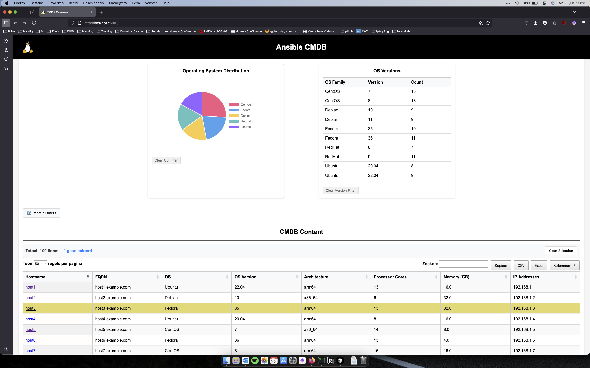
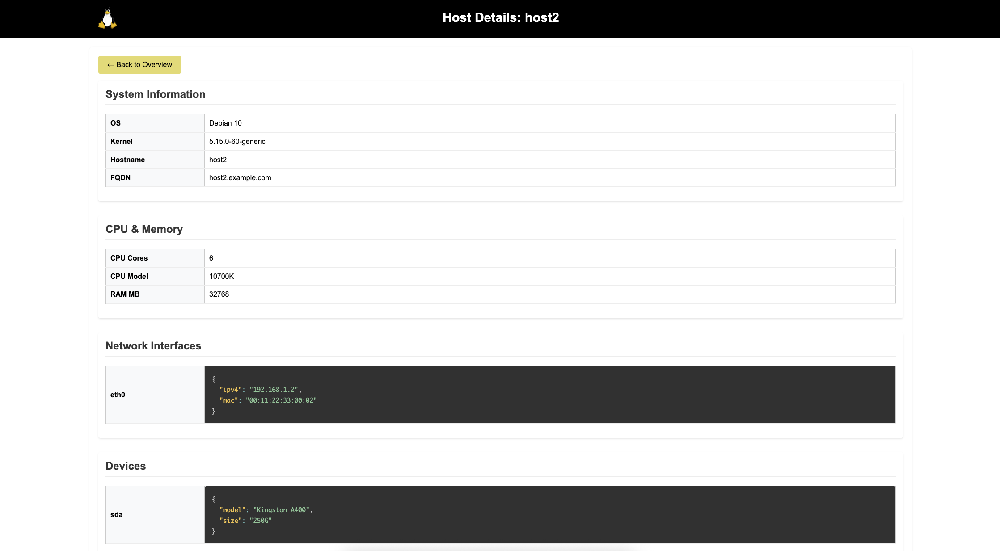

<a name="readme-top"></a>
# 📖 Ansible CMDB Flask App <a name="about-project"></a>

>This project provides a Flask-based CMDB (Configuration Management Database) application. You can run the app using Docker or Docker Compose for easy deployment and management.




## 🛠 Built With <a name="built-with"></a>
* Jquery
* Python
* Flask
* Datatables

## Prerequisites

- [Docker](https://www.docker.com/get-started) installed on your system
- (Optional) [Docker Compose](https://docs.docker.com/compose/) for multi-container setups

## 💻 Getting Started <a name="getting-started"></a>

### Build and Run with Docker

1. **Build the Docker image:**
    ```sh
    docker build -t cmdb-flask-app .
    ```

2. **Run the container:**
    ```sh
    docker run -p 5000:5000 -v cmdb-flask-app
    ```

3. **Mount a local facts directory (optional):**
    ```sh
    docker run -p 5000:5000 -v /path/to/your/facts:/app/facts cmdb-flask-app
    ```

    Replace `/path/to/your/facts` with the actual path to your facts directory.

### Run with Docker Compose

1. **Start the application:**
    ```sh
    docker-compose up --build
    ```

The application will be available at [http://localhost:5000](http://localhost:5000).


<!-- CONTRIBUTING -->

## 🤝 Contributing <a name="contributing"></a>

Contributions, issues, and feature requests are welcome!
Feel free to check the [issues page](../../issues/).
<p align="right">(<a href="#readme-top">back to top</a>)</p>

<!-- SUPPORT -->
## ⭐️ Show your support <a name="support"></a>
> Write a message to encourage readers to support your project

If you like this project...
<p align="right">(<a href="#readme-top">back to top</a>)</p>


## 📝 License <a name="license"></a>

This project is [MIT](./LICENSE) licensed.
<p align="right">(<a href="#readme-top">back to top</a>)</p>

